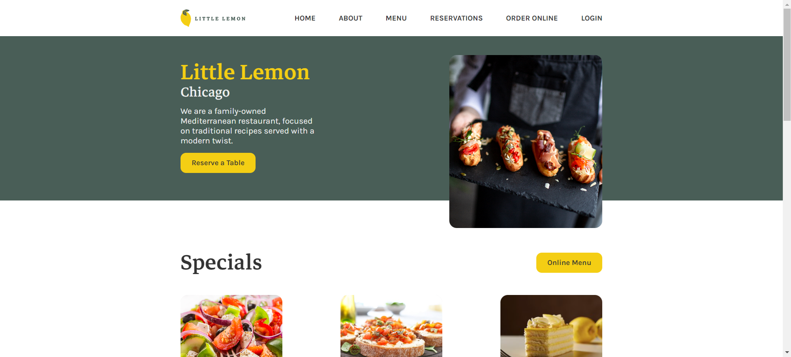
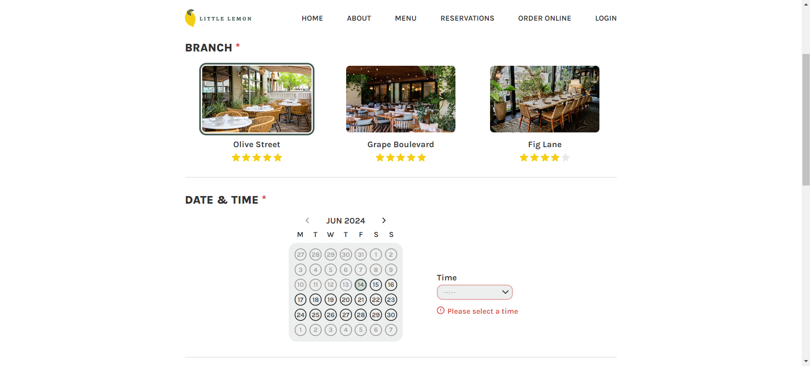
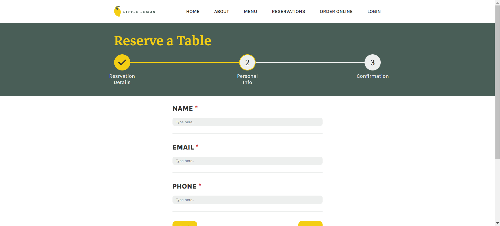

<a name="readme-top"></a>

<!-- PROJECT LOGO -->
<br />
<div align="center">
  
</div>

<h3 align="center">Little Lemon</h3>

  <p align="center">
    A web application for a mediterranean restaurant.
  </p>
</div>

<!-- ABOUT THE PROJECT -->
## About The Project


This web application was created using React JS as the capstone project for the <a href="https://www.coursera.org/professional-certificates/meta-front-end-developer" target="_blank">Meta Frontend Developer Professional Certificate</a>.
It serves as a website for the mediterranean restaurant, Little Lemon, with a landing page that tells you about them and showcases part of their menu as well as some reviews. It also has a table reservation form complete with client-side validation, which was the main focus of the project.

### Built With
* [![React][React.js]][React-url]

### Installation

1. Clone the repo
   ```sh
   git clone https://github.com/farah065/Table-Booking-System.git
   ```
2. Install NPM packages
   ```sh
   npm install
   ```
3. Start server
   ```sh
   npm start
   ```

<!-- USAGE EXAMPLES -->
## Usage




<p align="right">(<a href="#readme-top">back to top</a>)</p>


<!-- MARKDOWN LINKS & IMAGES -->
<!-- https://www.markdownguide.org/basic-syntax/#reference-style-links -->
[React.js]: https://img.shields.io/badge/React-20232A?style=for-the-badge&logo=react&logoColor=61DAFB
[React-url]: https://img.shields.io/badge/React-20232A?style=for-the-badge&logo=react&logoColor=61DAFB

<!-- Credit to Othneil Drew for the template: https://github.com/othneildrew/Best-README-Template -->